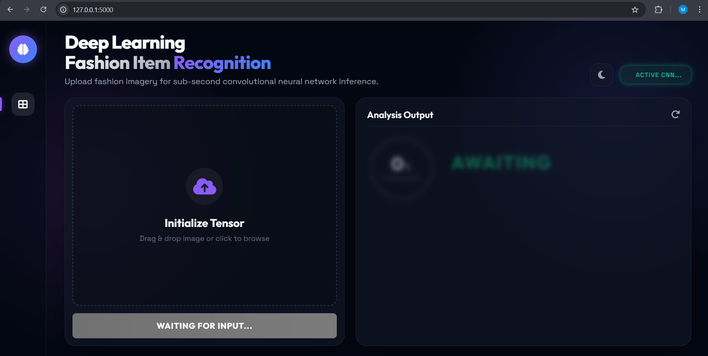
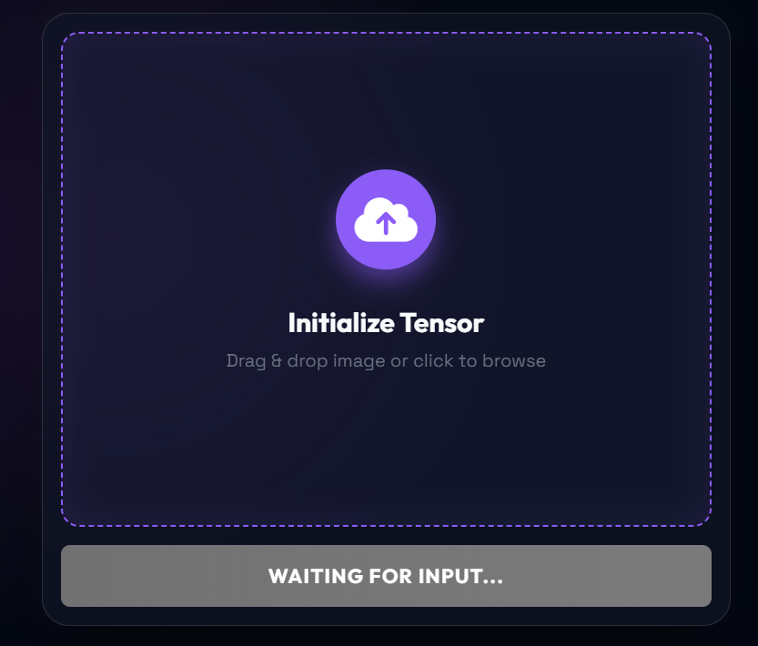
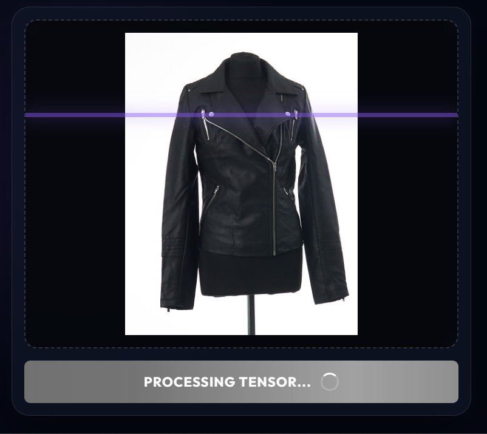
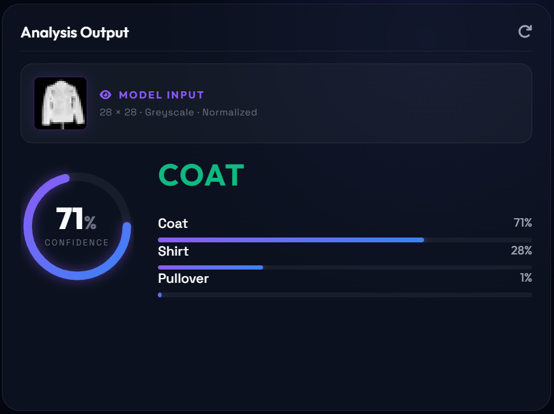
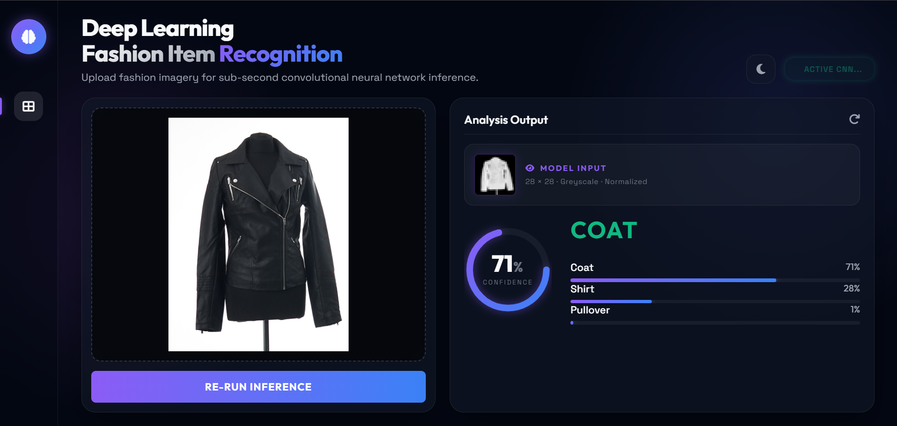
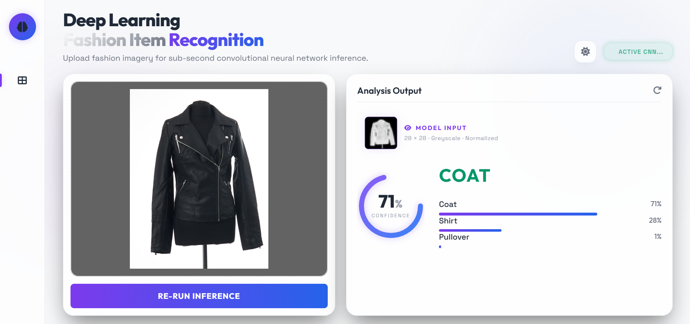

# FashionVision AI | Advanced Analytics Dashboard

A high-performance deep learning dashboard for Fashion-MNIST classification with real-time inference and interactive analytics.

## Table of Contents

- [Overview](#overview)
- [User Interface](#user-interface)
- [Features](#features)
- [System Architecture](#system-architecture)
- [Installation](#installation)
- [Usage](#usage)
- [Requirements](#requirements)
- [Project Structure](#project-structure)
- [Model Details](#model-details)
- [Contributing](#contributing)
- [License](#license)

## Overview

FashionVision AI is a web-based application that provides an intuitive interface for classifying fashion items using the Fashion-MNIST dataset. The system combines a Convolutional Neural Network (CNN) model with a modern web dashboard to deliver real-time predictions and comprehensive analytics.

The application serves as both a demonstration of deep learning capabilities and a practical tool for fashion image classification, featuring a sleek, futuristic UI design with glassmorphism effects and interactive visualizations.


## User Interface



 










## Features

- **Futuristic UI**: Glassmorphism design with neon accents and cyber-minimal aesthetic
- **Light/Dark Theme**: Full theme support with persistent preference storage
- **Vision Analytics**: Interactive progress rings and top-3 prediction charts
- **Multi-View Preview**: Compare source input, grayscale channels, and 28x28 AI tensors
- **Real-Time Inference**: Powered by a CNN model with ~94% accuracy
- **SaaS Dashboard**: Pro-level analytics with sidebar navigation and mobile responsiveness
- **Image Processing**: Automatic image preprocessing and resizing for optimal model input
- **Responsive Design**: Fully responsive interface that works on desktop and mobile devices

## System Architecture

The system consists of three main components:

1. **Frontend**: HTML/CSS/JavaScript dashboard with modern UI components
2. **Backend**: Flask web server handling API requests and serving static files
3. **AI Model**: TensorFlow/Keras CNN model for image classification

### Data Flow

1. User uploads an image through the web interface
2. Image is processed and resized to 28x28 pixels
3. Preprocessed image is fed to the CNN model
4. Model returns prediction probabilities for 10 fashion categories
5. Results are visualized and displayed to the user

## Installation

### Prerequisites

- Python 3.8 or higher
- Virtual environment (recommended)

### Step-by-Step Installation

1. **Clone the repository** (if applicable):

   ```bash
   git clone https://github.com/MalshaJayamanne/fashion-classificaion
   cd my-model
   ```

2. **Create a virtual environment**:

   ```bash
   python -m venv venv
   ```

3. **Activate the virtual environment**:
   - Windows:
     ```bash
     venv\Scripts\activate
     ```
   - macOS/Linux:
     ```bash
     source venv/bin/activate
     ```

4. **Install dependencies**:

   ```bash
   pip install -r requirements.txt
   ```

5. **Verify installation**:
   ```bash
   python -c "import tensorflow as tf; print('TensorFlow version:', tf.__version__)"
   ```

## Usage

### Running the Application [venv]

1. **Start the Flask server**:

   ```bash
   python app.py
   ```

2. **Open your browser** and navigate to:
   ```
   http://localhost:5000
   ```

### Using the Dashboard

1. **Upload Image**: Click the upload area or drag and drop an image
2. **View Preprocessing**: See the original image, grayscale conversion, and 28x28 tensor
3. **Get Predictions**: View the top 3 predictions with confidence scores
4. **Explore Analytics**: Check the interactive charts and progress rings

### API Usage

The application provides REST API endpoints:

- `GET /`: Main dashboard page
- `POST /predict`: Image classification endpoint
- `GET /static/<path>`: Static file serving

## Requirements

### Python Dependencies

- Flask==3.1.3
- flask-cors==6.0.2
- tensorflow==2.21.0
- keras==3.14.1
- numpy==2.4.4
- pillow==12.2.0
- pandas==3.0.2
- matplotlib==3.10.9
- scikit-learn==1.8.0
- seaborn==0.13.2

### Hardware Requirements

- Minimum: 4GB RAM, modern CPU
- Recommended: 8GB+ RAM, GPU for faster inference (optional)

### Software Requirements

- Python 3.8+
- Modern web browser (Chrome, Firefox, Safari, Edge)

## Project Structure

```
my-model/
├── app.py                 # Main Flask application
├── fashion_classification.ipynb  # Jupyter notebook for model development
├── image_converter.py     # Image preprocessing utilities
├── test_model.py          # Model testing script
├── requirements.txt       # Python dependencies
├── README.md             # Project documentation
├── data/                 # Dataset files
│   ├── fashion-mnist_test.csv
│   ├── fashion-mnist_train.csv
│   └── ... (binary files)
├── saved_model/          # Trained model files
│   └── my_model.keras
├── static/               # Static web assets
│   ├── script.js
│   └── style.css
├── templates/            # HTML templates
│   └── index.html
└── 28x28/               # Processed image samples
```

## Model Details

### Architecture

- **Type**: Convolutional Neural Network (CNN)
- **Input**: 28x28 grayscale images
- **Output**: 10-class classification
- **Accuracy**: ~94% on test set

### Classes

The model classifies images into 10 fashion categories:

1. T-shirt/top
2. Trouser
3. Pullover
4. Dress
5. Coat
6. Sandal
7. Shirt
8. Sneaker
9. Bag
10. Ankle boot

### Training

- **Dataset**: Fashion-MNIST (70,000 images)
- **Framework**: TensorFlow/Keras
- **Optimizer**: Adam
- **Loss Function**: Categorical Crossentropy

## Contributing

1. Fork the repository
2. Create a feature branch (`git checkout -b feature/AmazingFeature`)
3. Commit your changes (`git commit -m 'Add some AmazingFeature'`)
4. Push to the branch (`git push origin feature/AmazingFeature`)
5. Open a Pull Request

### Development Guidelines

- Follow PEP 8 style guidelines
- Add tests for new features
- Update documentation as needed
- Ensure all tests pass before submitting PR

## License

This project is licensed under the MIT License - see the [LICENSE](LICENSE) file for details.

## Acknowledgments

- Fashion-MNIST dataset by Zalando Research
- TensorFlow and Keras for the deep learning framework
- Flask for the web framework
- Open source community for various libraries and tools
